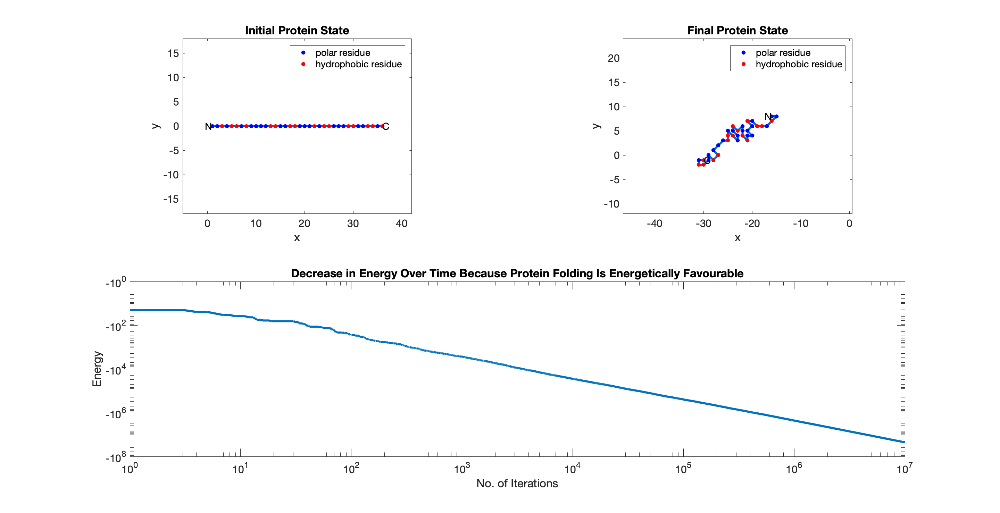

## Introduction

A protein can be simplified to a string of beads, which either correspond to a hydrophobic (H) or a polar (P) amino acid residue. Any pair of beads can interact by a [Lennard-Jones potential](https://en.wikipedia.org/wiki/Lennard-Jones_potential) V(r) given by:

<p align="center">V(r) = e[r<sup>-12</sup>-2r<sup>-6</sup>]</p>

where r is the **normalised** distance between the two beads. Assuming both beads are not direct neighbours in the primary structure, we let:
* e = E<sup>HH</sup> = -2.3 if both beads are of type H.
* e = E<sup>HP</sup> = -1 if both beads are of different types.
* e = E<sup>PP</sup> = 0 if both beads are of type P.

Otherwise, if they are direct neighbours, we let e = E<sup>NN</sup> = -10 independent of type.

By summing up the Lennard-Jones potential of all pairs of beads, we can calculate the difference in the energy before and after a given folding sequence. This allows us to show that protein folding is driven by a decrease in energy (a.k.a. a release of energy to the surrounding environment).

## Why is protein folding considered an unsolved problem in biology?

In 1969, [Craig Levinthal](https://en.wikipedia.org/wiki/Levinthal%27s_paradox) noted that, because of the very large number of degrees of freedom in an unfolded polypeptide chain, the molecule has an astronomical number of possible conformations. Assuming that there are 3 possible conformations per residue, for a polypeptide 100 residues long (and thus with 198 phi and psi bond angles), there would be 3<sup>198</sup> possible structures that the polypeptide can fold into. However, all except just one of these structures are the wrong one, i.e. a mutant with a defective function. If a protein were to randomly explore all its possible conformations during folding, it would require a time longer than the age of the universe to arrive at its correct native structure. Since most proteins fold spontaneously on a time-scale of micro- to milliseconds, we could thus infer that protein folding is not random.

Later on, the [landscape theory](https://en.wikipedia.org/wiki/Folding_funnel) was proposed. This theory states that protein folding is mediated by an energy landscape that directs/funnels the multiple unfolded conformations along a specific folding pathway towards the native structure (global minimum). This funneling is accompanied by sharp increases in the conformational stability (or decreases in Gibbs free energy) of the protein, e.g. via the [hydrophobic effect](https://en.wikipedia.org/wiki/Hydrophobic_effect). In addition, the energy landscape can have local minima in which partially folded prot can be trapped.

To truly understand how protein folding can take place so spontaneously, we require in-depth [Molecular Dynamics (MD)](https://en.wikipedia.org/wiki/Molecular_dynamics) studies. However, their effectiveness is limited by their large computational cost. Therefore, it is not easy to predict the final folded structure of a random polypeptide. In fact, in computer science, protein folding is considered an [NP-hard](https://ieeexplore.ieee.org/document/6965037) problem; once given the native structure of the protein, one could verify it in polynomial time. Coming up with this solution, on the other hand, takes significantly longer and is more difficult/challenging. If we can more clearly understand protein folding, we could be better equipped to tackle diseases caused by misfolded proteins. These include neurodegenerative disorders like Alzheimer's.

## Methods

To create a local copy of this repository, simply click 'Download'. Alternatively, clone it by first navigating to the path you want to store the local copy and then executing the following on the command line:
```
git clone https://github.com/liweiyap/ProteinFolding.git
```

The main program in [`main.m`](https://github.com/liweiyap/ProteinFolding/blob/master/main.m) calls the helper function in [`include/fold.m`](https://github.com/liweiyap/ProteinFolding/blob/master/include/fold.m), which simulates protein folding in 2-D. We implemented the [Metropolis algorithm](https://github.com/liweiyap/ProteinFolding/blob/master/include/metropolis.m), which accepts a trial move (small change in the position of a randomly chosen bead in the x-y plane) with a probability:

<p align="center">p('accept') = min{1, exp(-(E<sub>f</sub>-E<sub>i</sub>)/T)}</p>

where E<sub>f</sub> is the new energy after the trial move and E<sub>i</sub> is the initial energy before the trial move. T is the temperature. To simplify our model, we initialise T as 1, and consider only the bead that moves when calculating the energy change during a trial move. The number of trial moves, i.e. the number of iterations of the Metropolis algorithm, is user-defined.

The code was written using Matlab **version R2016b**. To test our code, we used the following 36-residue long polypeptide [(Li et al., 1996)](https://science.sciencemag.org/content/273/5275/666.long), where the dark and light grey residues are H and P respectively:

<p align="center">
  
</p>

A sample output of the code following 10<sup>7</sup> iterations of the Metropolis algorithm is shown here:

<p align="center">
  
</p>

The computational time taken was <300 seconds (a previous [non-refactored version](https://github.com/liweiyap/ProteinFolding/commit/d70dad#diff-8e4eefd2147cccf00633cf279453331a) of the code ran in half this time). In a folded protein, one would expect the H residues to be shielded from the aqueous environment by the P residues. However, it is possible that we do not get such a perfect folding because our polypeptide in question is only 36 residues long. A likelier explanation is that, since the Metropolis algorithm is probabilistic, the polypeptide might already be in the process of being funneled towards a local rather than a global minimum.

On the other hand, hydrophobic patches have been reported to exist on the external surface of proteins and might even have important biological functions, e.g. for protein-protein interactions in the formation of large molecular complexes for intracellular signalling. In any case, in our sample output, we do already see non-neighbouring residues of the same type clustering together to aid the folding of the polypeptide; this clustering is made possible because it is energetically favourable.

## Credits

This repository was inspired by a systems biology coursework from the final year of my bachelor's studies in biotechnology, majoring in computational biology. During this course, I learnt programming from scratch and, as a rookie, I was not able to perform this simulation at all back then. The lecturer of this course was [Prof. Robert Endres](https://rgendres3.wixsite.com/biologicalphysics).

The image of the test polypeptide was taken from a paper by Ned Wingreen's group. The full reference of this paper is:
* Li, H., Helling, R., Tang, C., & Wingreen, N. (1996). Emergence of Preferred Structures in a Simple Model of Protein Folding. Science, 273(5275), 666–669.
